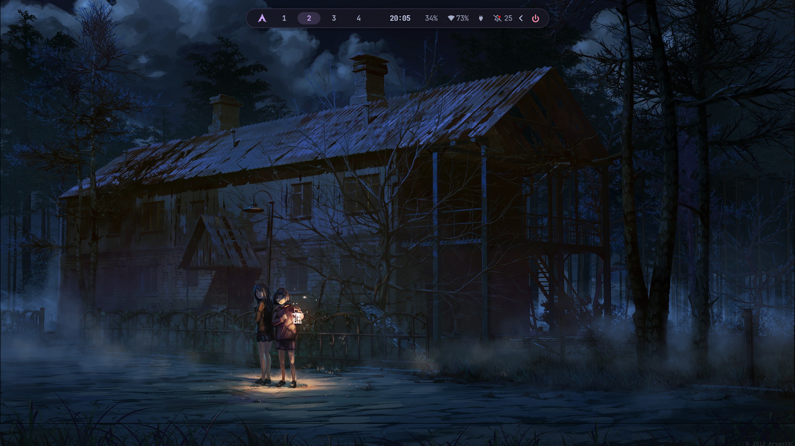
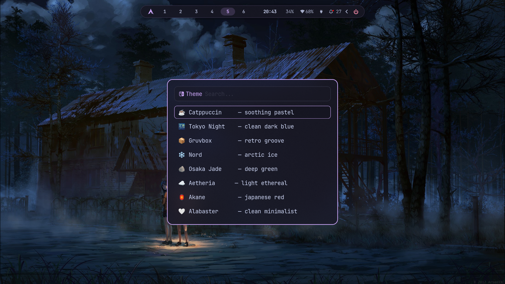

<div align="center">
  
  
  <h1>🌸 HyprZen</h1>
  <p><b>An ultra-minimal, zen-inspired dotfiles setup for Hyprland on Arch Linux.</b></p>
  
  <p>
    <a href="#-features">Features</a> •
    <a href="#-showcase">Showcase</a> •
    <a href="#-installation">Installation</a> •
    <a href="#%EF%B8%8F-keybindings">Keybinds</a>
  </p>
</div>

---

## ✨ Features

- **Universal System Theming**: Press `SUPER + T` to instantly switch your entire system's aesthetic. It seamlessly syncs Waybar, Rofi, Kitty, Hyprland borders, GTK themes (for Librewolf/Firefox), Neovim, and **VSCodium** in real-time.
- **13 Immersive Themes**: Includes Catppuccin (Mocha/Latte), Nord, Gruvbox, Tokyo Night (Moon/Storm), Everforest, Kanagawa, Noir, GitHub Light, One Dark, and Rosé Pine. 
- **Dynamic Island Waybar**: Completely replaces a boring static bar with a sleek, floating, expanding "dynamic island" pill in the top-center. Instantly swap between `minimal`, `pill`, and `dynamic-island` using `Super + W`.
- **Aesthetic Glassmorphism**: Stunning Kawase blur (3 passes), minimal borders, and transparent background glass effects across all applications including Rofi, VS Code, and terminal windows.
- **Automated Wallpaper Downloader**: Pick 100+ high-res, aesthetic PC wallpapers effortlessly through an immersive transparent Rofi grid GUI (`SUPER + ALT + W`).
- **Beautiful Typography**: Pre-configured to use the stunning `GeistMono Nerd Font` everywhere.
- **Smart Workspaces**: Workspaces 1-4 are always visible for consistency, while 5-10 generate dynamically only when you need them.
- **Automated Setup**: A bulletproof `setup.sh` script that automatically installs dependencies, downloads fonts, backs up old configs, and initializes dynamic themes.

---

## 📸 Showcase

<table align="center">
  <tr>
    <td align="center">
      <b>Clean Desktop Environment</b><br>
      
    </td>
    <td align="center">
      <b>Dynamic Theme Switcher</b><br>
      
    </td>
  </tr>
</table>

*(Add more screenshots to the `assets/` folder to show off your themes!)*

---

## 🚀 Installation

### Supported Distributions
HyprZen is heavily optimized for **Arch Linux** and Arch-based distributions. It has been tested and works flawlessly on:
- Arch Linux
- CachyOS
- EndeavourOS
- Manjaro / Garuda

### How to Install
The installation process is split into two scripts that work together automatically:
* **`setup.sh`**: Downloads and installs all the required programs, fonts, and AUR packages.
* **`install.sh`**: Safely backs up your old configuration files and symlinks the HyprZen aesthetic into your `~/.config` folder.

**1. Clone the repository:**
```bash
git clone https://github.com/zenXD45/HyprZen.git
cd HyprZen
```

**2. Run the automated setup:**
```bash
# This handles both dependencies (via setup.sh) and symlinking (via install.sh)
./setup.sh
```

**3. Reload Hyprland:**
Press `SUPER + CTRL + R` to reload Hyprland and apply all the new configurations.

---

## ⌨️ Keybindings

HyprZen uses an ultra-minimal keybind configuration. 

| Action | Shortcut |
| :--- | :--- |
| **Terminal (Kitty)** | `SUPER + ENTER` |
| **App Launcher (Rofi)** | `SUPER + SPACE` |
| **Theme Switcher** | `SUPER + T` |
| **Waybar Layout Switcher** | `SUPER + W` |
| **Wallpaper Picker** | `SUPER + ALT + W` |
| **Close Window** | `SUPER + Q` |
| **Toggle Fullscreen** | `SUPER + F` |
| **Toggle Floating** | `SUPER + SHIFT + F` |
| **Toggle Opaque / Blur** | `SUPER + O` |
| **Region Screenshot (Annotate)** | `SUPER + Print` |
| **Region Screenshot (Clipboard)** | `SUPER + CTRL + Print` |
| **Dismiss Notifications** | `SUPER + SHIFT + N` |

---

## 🛠️ Structure

```text
HyprZen/
├── .config/
│   ├── hypr/         # Core Hyprland configuration & rules
│   ├── kitty/        # Terminal emulator themes
│   ├── rofi/         # App launcher, clipboard, and theme menus
│   ├── waybar/       # Status bar and modular styles
│   ├── nvim/         # Neovim dotfiles integrated with global themes
│   └── ...
├── scripts/
│   ├── theme-switch.sh     # Global VSCodium, Nvim, GTK, Rofi, Kitty theme switcher
│   ├── waybar-switcher.sh  # Live waybar layout toggler
│   └── ...
├── install.sh        # Core symlink installer and backup utility
└── setup.sh          # Dependency wrapper & font installer for Arch Linux
```

---
<div align="center">
  <i>Stay Minimal. Stay Zen.</i>
</div>
